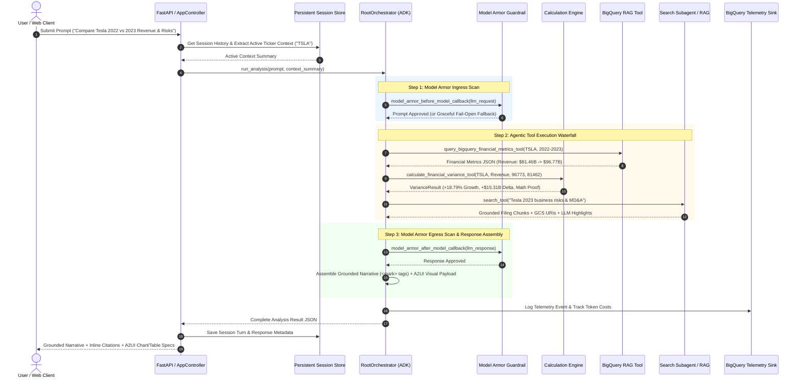
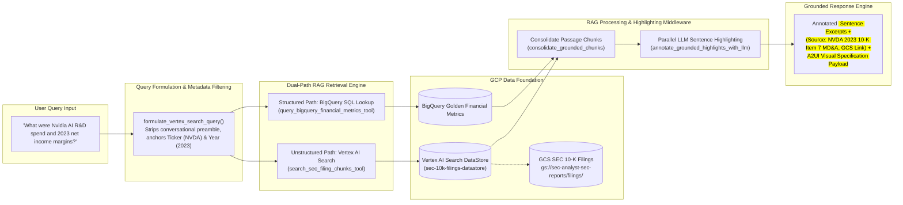
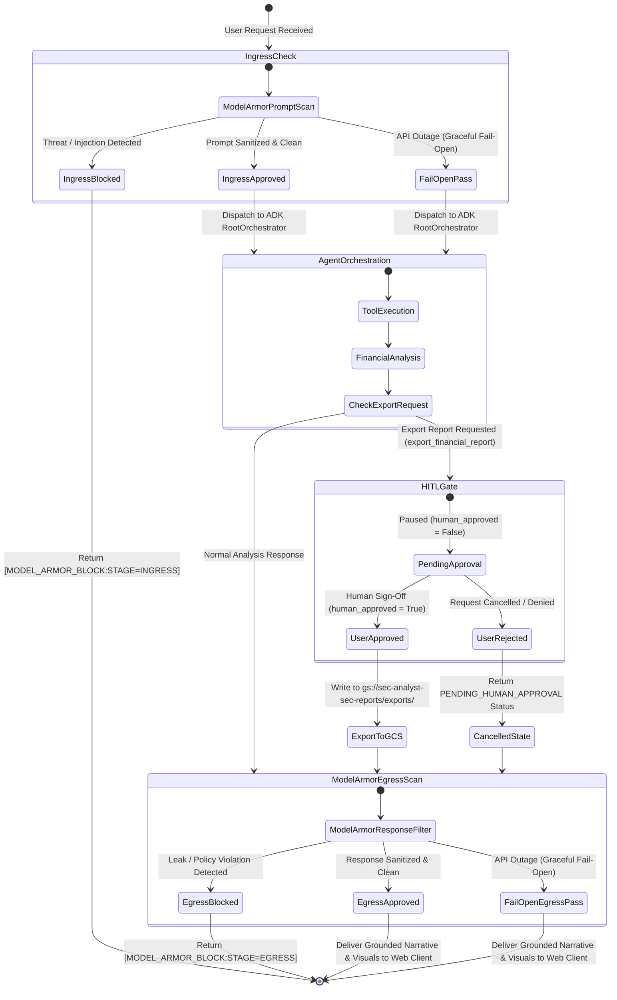
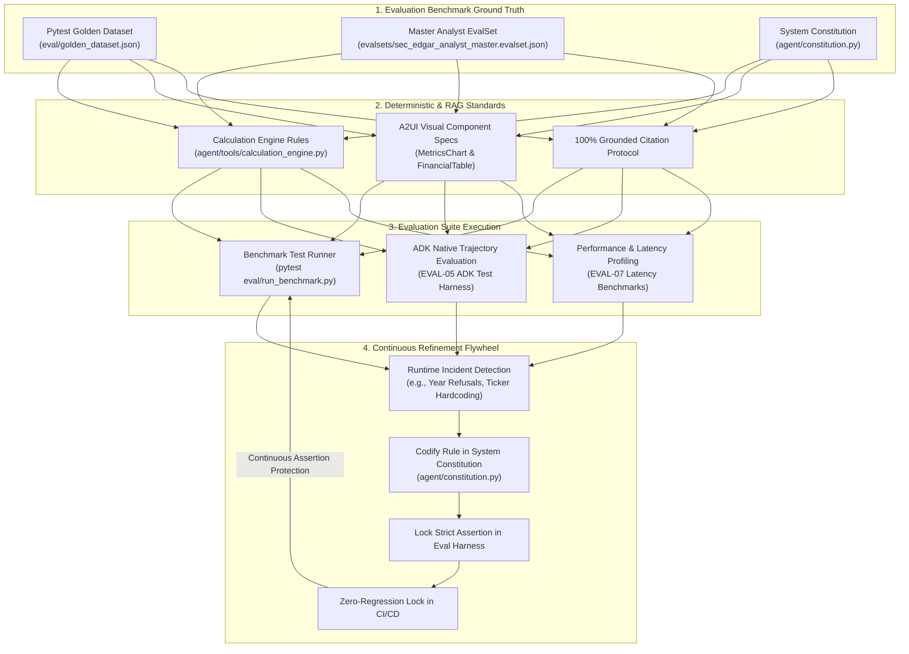
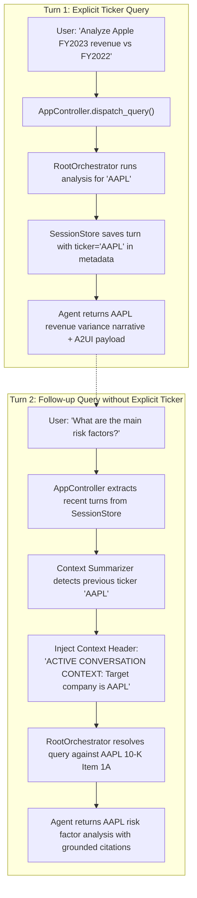

# 📐 SEC EDGAR Natural Language Analyst — Architectural Diagrams

This document contains the authoritative, production-grade Mermaid diagrams for the **SEC EDGAR Natural Language Analyst** application. You can paste these directly into [mermaid.live](https://mermaid.live) to export ultra-high-resolution PNGs/SVGs for presentations, or view them rendered directly in GitHub and Antigravity.

---

## Diagram 1: End-to-End System Architecture (ADK + Model Armor + RAG + Telemetry)

> [!TIP]
> 🎨 **Presentation Slide SVG Asset**: A widescreen 16:9 vector SVG file aligned with Google Cloud Light Theme is available at [`docs/images/architecture_diagram1_gcp_light.svg`](file:///Users/cvwang/Documents/gcp/sec-edgar-analyst/docs/images/architecture_diagram1_gcp_light.svg).

---

## Diagram 2: Agentic Execution & Tool Decision Waterfall

---

## Diagram 3: Hybrid Search RAG Dual-Path Retrieval Waterfall

---

## Diagram 4: Security Perimeter & Human-In-The-Loop Approval Gate

---

## Diagram 5: Evaluation Framework & Continuous Refinement Flywheel

---

## Diagram 6: Multi-Turn Memory & Target Ticker Context Propagation

