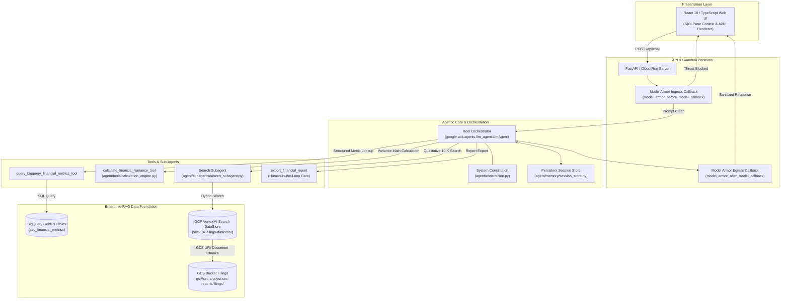
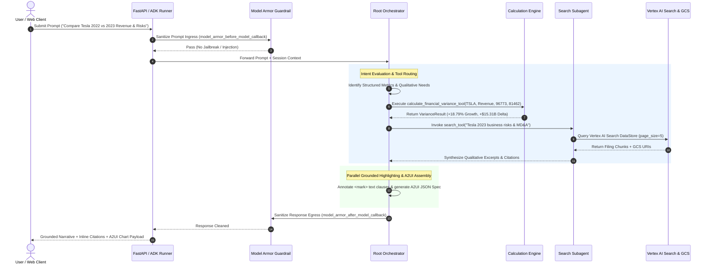
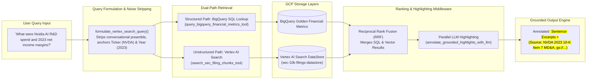
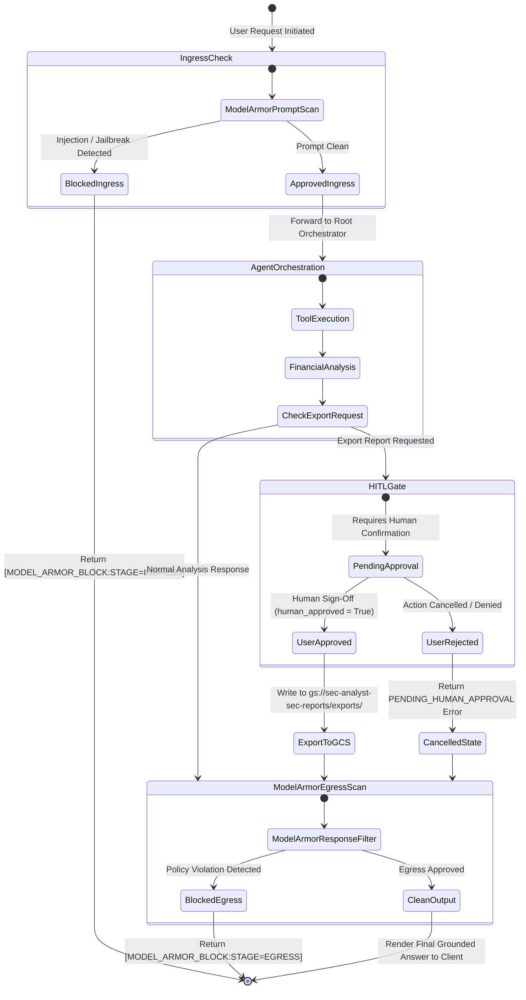
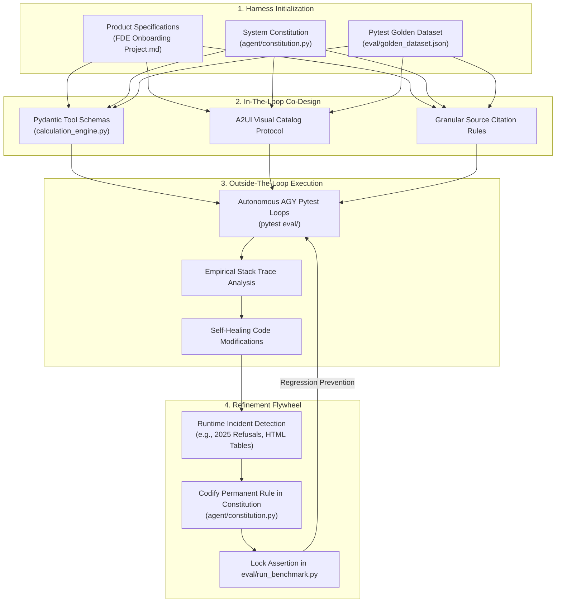

# 📐 SEC EDGAR Natural Language Analyst — Updated Architectural Diagrams

This document contains the latest production-grade Mermaid diagrams for the SEC EDGAR Natural Language Analyst application. You can paste these directly into [mermaid.live](https://mermaid.live) to export ultra-high-resolution PNGs/SVGs for your slides, or view them rendered inside Antigravity and GitHub.

---

## Diagram 1: End-to-End System Architecture (ADK + Model Armor + RAG)

---

## Diagram 2: Agentic Execution & Tool Decision Waterfall

---

## Diagram 3: Hybrid Search RAG Dual-Path Retrieval Waterfall

---

## Diagram 4: Security Perimeter & Human-In-The-Loop Approval Gate

---

## Diagram 5: Development Harness & Refinement Flywheel

