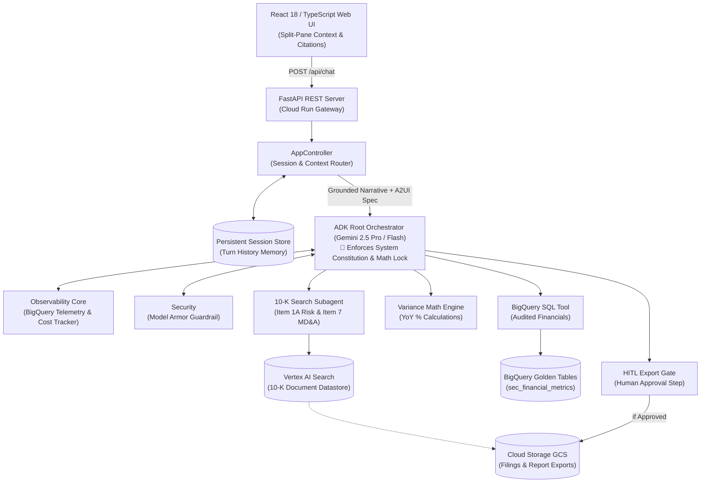
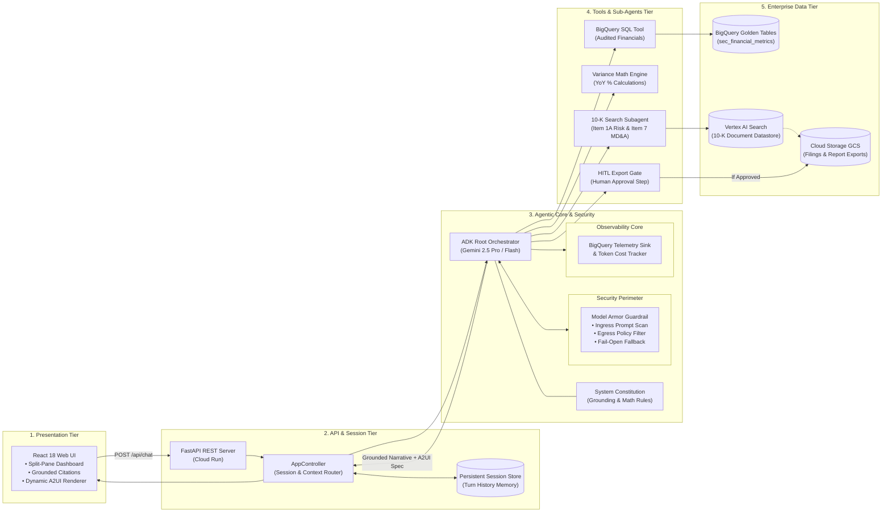
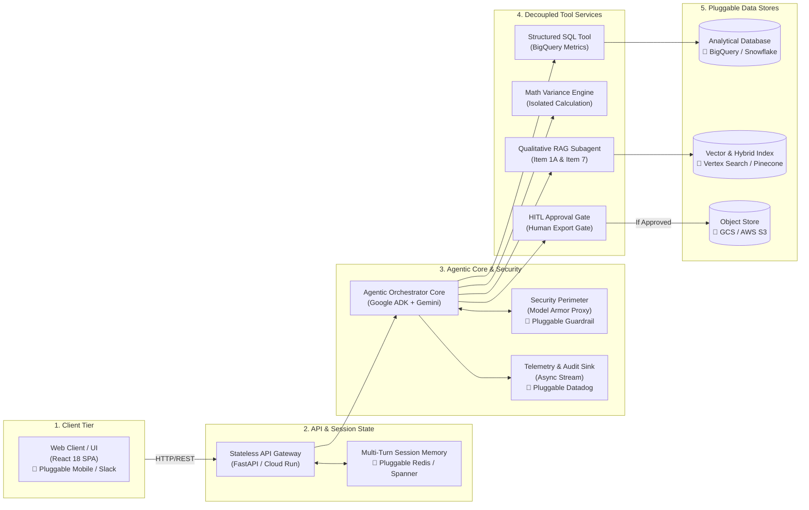
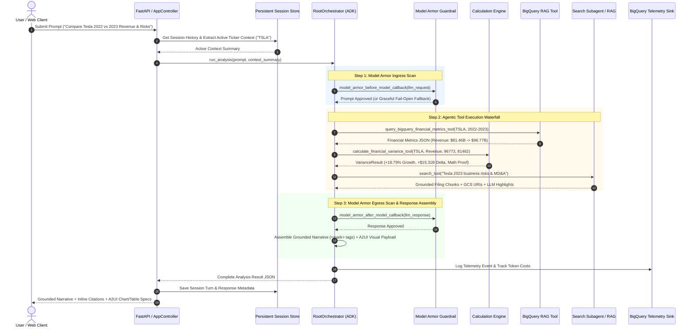
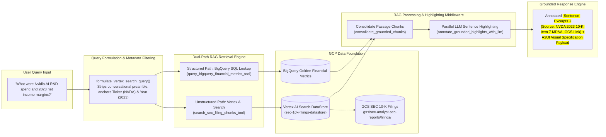
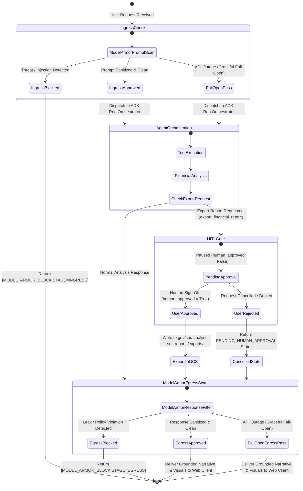
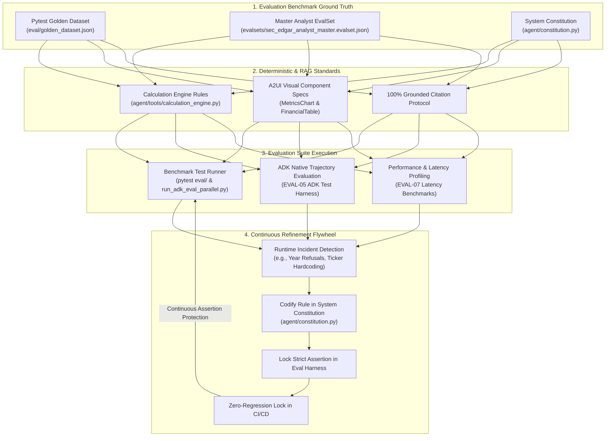
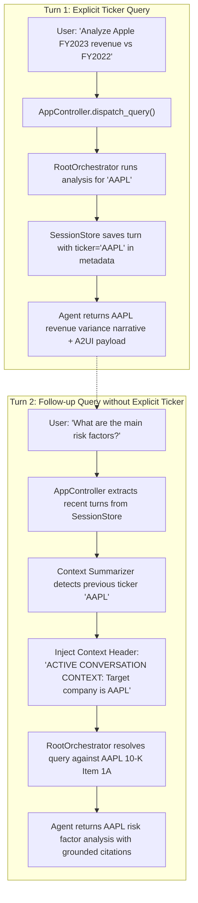
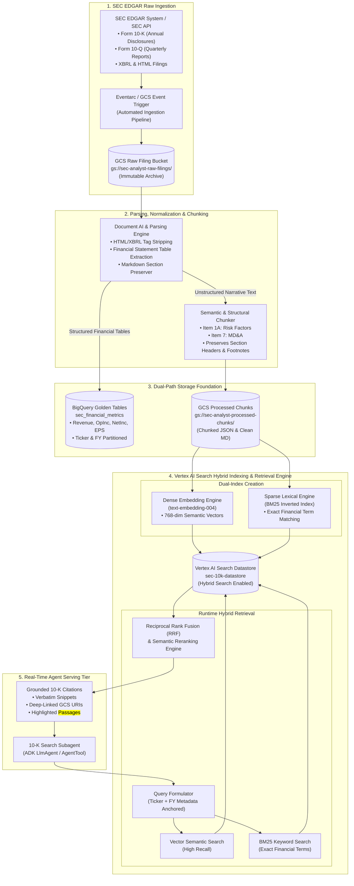

# 📐 SEC EDGAR Natural Language Analyst — Architectural Diagrams

This document contains the authoritative, production-grade Mermaid diagrams for the **SEC EDGAR Natural Language Analyst** application. You can paste these directly into [mermaid.live](https://mermaid.live) to export ultra-high-resolution PNGs/SVGs for presentations, or view them rendered directly in GitHub and Antigravity.

---

## Diagram 1D: Pure Unconstrained Architecture (Clean Organic Flow)

> [!TIP]
> 🎨 **Pure Diagram Assets (No Slide Frame Restraints)**:
> - **Pure Flow Vector SVG**: [`docs/architecture_diagram1_pure.svg`](file:///Users/cvwang/Documents/gcp/sec-edgar-analyst/docs/architecture_diagram1_pure.svg)
> - **4K Ultra-HD PNG**: [`docs/architecture_diagram1_4k.png`](file:///Users/cvwang/Documents/gcp/sec-edgar-analyst/docs/architecture_diagram1_4k.png)
> - **8K Super-HD PNG**: [`docs/architecture_diagram1_8k.png`](file:///Users/cvwang/Documents/gcp/sec-edgar-analyst/docs/architecture_diagram1_8k.png)

---

## Diagram 1A: Executive Presentation Architecture (Capstone Slide Ready)

> [!TIP]
> 🎨 **Presentation Slide Assets**:
> - **Widescreen 16:9 SVG**: [`docs/architecture_diagram1_executive.svg`](file:///Users/cvwang/Documents/gcp/sec-edgar-analyst/docs/architecture_diagram1_executive.svg)
> - **4K Ultra-HD PNG**: [`docs/architecture_diagram1_executive_4k.png`](file:///Users/cvwang/Documents/gcp/sec-edgar-analyst/docs/architecture_diagram1_executive_4k.png)
> - **8K Super-HD PNG**: [`docs/architecture_diagram1_executive_8k.png`](file:///Users/cvwang/Documents/gcp/sec-edgar-analyst/docs/architecture_diagram1_executive_8k.png)
> - **Editable PowerPoint (.pptx)**: [`docs/architecture_diagram1_editable.pptx`](file:///Users/cvwang/Documents/gcp/sec-edgar-analyst/docs/architecture_diagram1_editable.pptx)

---

## Diagram 1B: Detailed Technical Architecture (Comprehensive Code Specification)

> [!TIP]
> 🎨 **Detailed Code Assets**:
> - **Widescreen 16:9 SVG**: [`docs/architecture_diagram1_detailed.svg`](file:///Users/cvwang/Documents/gcp/sec-edgar-analyst/docs/architecture_diagram1_detailed.svg)
> - **4K Ultra-HD PNG**: [`docs/architecture_diagram1_detailed_4k.png`](file:///Users/cvwang/Documents/gcp/sec-edgar-analyst/docs/architecture_diagram1_detailed_4k.png)
> - **8K Super-HD PNG**: [`docs/architecture_diagram1_detailed_8k.png`](file:///Users/cvwang/Documents/gcp/sec-edgar-analyst/docs/architecture_diagram1_detailed_8k.png)
> - **Editable PowerPoint (.pptx)**: [`docs/architecture_diagram1_detailed_editable.pptx`](file:///Users/cvwang/Documents/gcp/sec-edgar-analyst/docs/architecture_diagram1_detailed_editable.pptx)

```mermaid
flowchart TD
    subgraph Presentation ["1. Presentation Layer"]
        UI["React 18 / TypeScript Web UI<br/>(agent/ui/src/)"]
    end

    subgraph API_Session ["2. API & Session Layer"]
        FastAPI["FastAPI REST Server<br/>(agent/api.py)"]
        AppController["AppController<br/>(app/app_controller.py)"]
        SessionStore["Persistent Session Store<br/>(agent/memory/session_store.py)"]
    end

    subgraph ADK_Orchestrator ["3. Agentic Core & Security (ADK Framework)"]
        RootOrchestrator["RootOrchestrator<br/>(agent/root_orchestrator.py)"]
        ADK_Runner["Google ADK Runner & LlmAgent<br/>(google.adk.runners.Runner)"]
        Constitution["System Constitution<br/>(agent/constitution.py)"]
        
        subgraph Guardrails ["Model Armor Security Guardrails"]
            ModelArmorIn["Ingress Guardrail Callback<br/>(model_armor_before_model_callback)"]
            ModelArmorOut["Egress Guardrail Callback<br/>(model_armor_after_model_callback)"]
            ModelArmorAPI[("GCP Model Armor API / Fail-Open Fallback")]
        end
        
        subgraph Observability ["Observability Core"]
            TelemetrySink["BigQuery Telemetry Sink<br/>(agent/observability/telemetry_sink.py)"]
            CostTracker["Token Cost Tracker<br/>(agent/observability/cost_tracker.py)"]
            Tracer["OpenTelemetry Tracer<br/>(agent/observability/tracer.py)"]
        end
    end

    subgraph Tools_Subagents ["4. Tools & Sub-Agents Layer"]
        BQTool["query_bigquery_financial_metrics_tool<br/>(agent/rag/bigquery_store.py)"]
        MathTool["calculate_financial_variance_tool<br/>(agent/tools/calculation_engine.py)"]
        SearchSubagent["Search Subagent & search_tool<br/>(agent/subagents/search_subagent.py)"]
        GroundingMW["LLM Grounding Middleware<br/>(annotate_grounded_highlights_with_llm)"]
        ExportTool["export_financial_report<br/>(Human-in-the-Loop Approval Gate)"]
    end

    subgraph RAG_Data ["5. Enterprise RAG Data Foundation"]
        BigQuery[("BigQuery Golden Tables<br/>(sec_financial_metrics)")]
        VertexSearch[("GCP Vertex AI Search DataStore<br/>(sec-10k-filings-datastore)")]
        GCSFilings[("GCS Bucket Filings<br/>gs://sec-analyst-sec-reports/filings/")]
        GCSExports[("GCS Bucket Exports<br/>gs://sec-analyst-sec-reports/exports/")]
    end

    %% Execution Flow Connections
    UI -->|POST /api/chat| FastAPI
    FastAPI --> AppController
    AppController <-->|Load / Save History & Ticker Context| SessionStore
    AppController -->|run_analysis| RootOrchestrator
    
    RootOrchestrator --> ADK_Runner
    ADK_Runner --- Constitution
    
    ADK_Runner -->|Before LLM Call| ModelArmorIn
    ModelArmorIn <--> ModelArmorAPI
    
    ADK_Runner -->|Structured Financial Metrics| BQTool
    ADK_Runner -->|Deterministic Variance Math| MathTool
    ADK_Runner -->|Qualitative 10-K Search| SearchSubagent
    ADK_Runner -->|Report Export Gate| ExportTool
    
    BQTool -->|SQL Metrics Query| BigQuery
    SearchSubagent -->|Hybrid Search| VertexSearch
    VertexSearch -->|GCS URI Document Chunks| GCSFilings
    SearchSubagent --> GroundingMW
    
    ExportTool -->|If Human Approved| GCSExports
    
    ADK_Runner -->|After LLM Call| ModelArmorOut
    ModelArmorOut <--> ModelArmorAPI
    
    RootOrchestrator --> TelemetrySink & CostTracker & Tracer
    RootOrchestrator -->|Grounded Narrative + A2UI Payload| AppController
    AppController --> FastAPI --> UI
```

---

## Diagram 1C: System Design & Modular Architecture (Interview & Scaling Whiteboard)

> [!TIP]
> 🎨 **System Design & Scaling Assets**:
> - **Widescreen 16:9 SVG**: [`docs/architecture_diagram1_system_design.svg`](file:///Users/cvwang/Documents/gcp/sec-edgar-analyst/docs/architecture_diagram1_system_design.svg)
> - **4K Ultra-HD PNG**: [`docs/architecture_diagram1_system_design_4k.png`](file:///Users/cvwang/Documents/gcp/sec-edgar-analyst/docs/architecture_diagram1_system_design_4k.png)
> - **8K Super-HD PNG**: [`docs/architecture_diagram1_system_design_8k.png`](file:///Users/cvwang/Documents/gcp/sec-edgar-analyst/docs/architecture_diagram1_system_design_8k.png)
> - **Editable PowerPoint (.pptx)**: [`docs/architecture_diagram1_system_design_editable.pptx`](file:///Users/cvwang/Documents/gcp/sec-edgar-analyst/docs/architecture_diagram1_system_design_editable.pptx)

---

## Diagram 2: Agentic Execution & Tool Decision Waterfall

> [!TIP]
> 🎨 **Sequence Diagram Presentation Slide Assets**:
> - **Widescreen 16:9 Vector SVG**: [`docs/sequence_diagram2_gcp_light.svg`](file:///Users/cvwang/Documents/gcp/sec-edgar-analyst/docs/sequence_diagram2_gcp_light.svg)
> - **4K Ultra-HD PNG**: [`docs/sequence_diagram2_4k.png`](file:///Users/cvwang/Documents/gcp/sec-edgar-analyst/docs/sequence_diagram2_4k.png)
> - **8K Super-HD PNG**: [`docs/sequence_diagram2_8k.png`](file:///Users/cvwang/Documents/gcp/sec-edgar-analyst/docs/sequence_diagram2_8k.png)
> - **Editable PowerPoint (.pptx)**: [`docs/sequence_diagram2_editable.pptx`](file:///Users/cvwang/Documents/gcp/sec-edgar-analyst/docs/sequence_diagram2_editable.pptx)

---

## Diagram 3: Hybrid Search RAG Dual-Path Retrieval Waterfall

---

## Diagram 4: Security Perimeter & Human-In-The-Loop Approval Gate

---

## Diagram 5: Evaluation Framework & Continuous Refinement Flywheel

---

## Diagram 6: Multi-Turn Memory & Target Ticker Context Propagation

---

## Diagram 7: End-to-End Data Ingestion & Vertex AI Hybrid Search Architecture (PRES-02)

