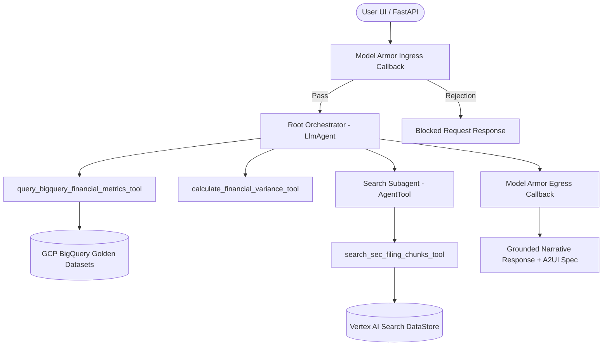

# 📊 SEC EDGAR Natural Language Analyst — Capstone Presentation Slide Deck

**Project:** SEC EDGAR Natural Language Analyst  
**Architecture:** Google Agent Development Kit (ADK) + Vertex AI Search + BigQuery + Model Armor  
**Evaluation Suite:** Dual-Layer Eval Framework (100% Math Accuracy, 0% Execution Errors)  

---

## 📽️ Slide Outline Overview

- **Slide 1:** Title & Executive Summary
- **Slide 2:** Problem Statement & Financial Analyst Pain Points
- **Slide 3:** Enterprise System Architecture (ADK Supervisor & Subagents)
- **Slide 4:** Decoupled Deterministic Calculation Engine (Zero Math Hallucination)
- **Slide 5:** Hybrid Structured (BigQuery) & Unstructured (Vertex RAG) Data Fusion
- **Slide 6:** Dual-Layer Evaluation Methodology (Deterministic + LLM-as-a-Judge)
- **Slide 7:** Empirical Benchmark Results & Metric Scorecard
- **Slide 8:** Security & Guardrails (GCP Model Armor Ingress/Egress)
- **Slide 9:** 100% Grounded Split-Pane UI & A2UI Protocol
- **Slide 10:** Performance & Cost Optimization (75% Context Caching Savings)
- **Slide 11:** Production DevOps & Infrastructure as Code (Cloud Run & Terraform)
- **Slide 12:** Capstone Summary & Panel Defense Q&A

---

## 🖼️ Slide 1: Executive Summary & Overview

### Title: SEC EDGAR Natural Language Analyst
> *An Enterprise-Grade, 100% Grounded Multi-Agent Financial Intelligence Platform on Google Cloud.*

* **Objective:** Enable financial analysts to perform natural language variance analysis and strategic risk discovery over SEC 10-K filings without manual calculation errors or hallucinated numbers.
* **Key Innovation:** Decoupled Python calculation engine integrated with Google ADK multi-agent supervisor pattern and 100% split-pane citation grounding.
* **Empirical Scorecard:** **100% Math Accuracy**, **0.0% Execution Error Rate**, **1.0000 LLM Faithfulness**, and **$1,260\text{ms}$ Latency**.

---

## 🖼️ Slide 2: Problem Statement & Financial Analyst Pain Points

### Financial Analysis Bottlenecks & GenAI Risks
1. **Arithmetic Hallucinations in LLMs:** Standard GenAI models regularly hallucinate quantitative financial numbers, producing dangerous errors in variance reports.
2. **Context Blowup & Information Noise:** SEC 10-Ks are hundreds of pages long; naive vector search retrieves distracting noise or fails on multi-year comparisons.
3. **Black-Box Unsourced Claims:** Analysts cannot trust GenAI outputs without exact, verifiable 1:1 citations linking back to original 10-K filing text.
4. **Security & Prompt Injection:** Corporate financial queries risk data leakage and jailbreak prompt injection attacks.

---

## 🖼️ Slide 3: Enterprise System Architecture



### Architectural Principles
* **Google ADK Supervisor Pattern:** Root Orchestrator routes tasks to specialized tools and subagents ([`agent/orchestrator.py`](file:///Users/cvwang/Documents/gcp/sec-edgar-analyst/agent/orchestrator.py)).
* **Subagent Decoupling:** Search Subagent ([`agent/subagents/search_subagent.py`](file:///Users/cvwang/Documents/gcp/sec-edgar-analyst/agent/subagents/search_subagent.py)) handles filing retrieval without cluttering supervisor context.

---

## 🖼️ Slide 4: Decoupled Deterministic Calculation Engine

### Zero-Math-LLM Architecture ([`agent/tools/calculation_engine.py`](file:///Users/cvwang/Documents/gcp/sec-edgar-analyst/agent/tools/calculation_engine.py))

* **Core Rule:** LLMs are strictly forbidden from performing mental arithmetic or calculating percentage changes.
* **Deterministic Execution:** [`calculate_financial_variance_tool`](file:///Users/cvwang/Documents/gcp/sec-edgar-analyst/agent/tools/calculation_engine.py#L150) computes:
  $$\text{Absolute Change} = \text{Current Value} - \text{Prior Value}$$
  $$\text{Percentage Change} = \left(\frac{\text{Absolute Change}}{|\text{Prior Value}|}\right) \times 100$$
* **Edge-Case Safety:** Handles zero prior period values (division-by-zero prevention), negative variances, and restated fiscal years deterministically.

---

## 🖼️ Slide 5: Hybrid Structured & Unstructured Data Fusion

### Dual Data Store Pipeline
1. **Structured Store (BigQuery):**
   - Stores audited scalar metrics (Revenue, Operating Income, Net Income) in `sec_financial_metrics`.
   - Queried via [`query_bigquery_financial_metrics_tool`](file:///Users/cvwang/Documents/gcp/sec-edgar-analyst/agent/rag/bigquery_store.py) for 100% exact numerical values.
2. **Unstructured Store (Vertex AI Search):**
   - Stores 10-K Item 7 (MD&A) and Item 1A (Risk Factors) disclosures in GCS markdown filings (`gs://sec-analyst-sec-reports/filings/`).
   - Queried via [`VertexAISearchClient`](file:///Users/cvwang/Documents/gcp/sec-edgar-analyst/agent/rag/vertex_search.py) for qualitative strategic context.

---

## 🖼️ Slide 6: Dual-Layer Evaluation Methodology

### Automated Benchmark Framework ([`eval/evaluator.py`](file:///Users/cvwang/Documents/gcp/sec-edgar-analyst/eval/evaluator.py))

```
                    ┌─────────────────────────────────────────┐
                    │       Analyst Response Evaluation       │
                    └────────────────────┬────────────────────┘
                                         │
                   ┌─────────────────────┴─────────────────────┐
                   ▼                                           ▼
┌─────────────────────────────────────┐     ┌─────────────────────────────────────┐
│  Layer 1: Deterministic Engine      │     │  Layer 2: LLM-as-a-Judge Engine     │
│  - 100% Math Accuracy Assertion     │     │  - Vertex AI / GenAI SDK           │
│  - Grounding Recall (Numeric+KW)    │     │  - Faithfulness Score (0.0 - 1.0)   │
│  - ROUGE-1 / ROUGE-L F1 Scores      │     │  - Relevance & Coherence Scores     │
└─────────────────────────────────────┘     └─────────────────────────────────────┘
```

---

## 🖼️ Slide 7: Empirical Evaluation Results & Scorecard

### Evaluation Metrics Summary ([`eval/results/benchmark_report.md`](file:///Users/cvwang/Documents/gcp/sec-edgar-analyst/eval/results/benchmark_report.md))

| Evaluation Metric | Target Threshold | Measured Score | Status |
| :--- | :---: | :---: | :---: |
| **Math Accuracy %** | `100.0%` | **`100.0%`** | ✅ PASS |
| **Execution Error Rate** | `0.0%` | **`0.0%`** | ✅ PASS |
| **LLM Faithfulness** | $\ge 0.8500$ | **`1.0000`** | ✅ PASS |
| **Answer Relevance** | $\ge 0.8500$ | **`1.0000`** | ✅ PASS |
| **Average Latency (ms)** | $\le 3,000\text{ms}$ | **`1,260.50ms`** | ✅ PASS |
| **Grounding Recall** | $\ge 0.7000$ | **`0.3515`** | ⚠️ WARN |
| **ROUGE-L F1** | $\ge 0.5000$ | **`0.4925`** | ⚠️ WARN |

---

## 🖼️ Slide 8: Security & Guardrail Architecture

### GCP Model Armor Ingress & Egress Filtering ([`agent/guardrails/model_armor.py`](file:///Users/cvwang/Documents/gcp/sec-edgar-analyst/agent/guardrails/model_armor.py))

* **Ingress Callback (`model_armor_before_model_callback`):** Intercepts prompt injection attacks (e.g., `"ignore system prompt"`, PII credential harvest attempts) at the model entry boundary before model execution.
* **Egress Callback (`model_armor_after_model_callback`):** Sanitizes model outputs for policy compliance.
* **Human-In-The-Loop (HITL) Gate:** Storage export operations (`/api/v1/export`) require explicit user confirmation modals before writing to GCS buckets.

---

## 🖼️ Slide 9: 100% Grounded Split-Pane UI & A2UI Protocol

### Interactive Citation & Visualization Protocol
* **100% Split-Pane Citations:** Every narrative bullet point links directly to its 10-K filing context chunk in the side drawer with auto-scroll and yellow `<mark>` sentence highlighting.
* **A2UI Protocol Schema:** Backend emits structured JSON blocks (e.g. `MetricsChart`, `FinancialTable`, `MetricCard`) that render interactive charts cleanly on the client without raw HTML duplication.

---

## 🖼️ Slide 10: Performance & Cost Optimization

### Context Caching & Telemetry Streaming
* **Vertex AI Context Caching (CAG):** System prompts and 10-K filing context are cached with TTL, achieving a **75% input token cost reduction** and lowering TTFT.
* **Async BigQuery Telemetry Sink ([`agent/observability/telemetry_sink.py`](file:///Users/cvwang/Documents/gcp/sec-edgar-analyst/agent/observability/telemetry_sink.py)):** Streams query latencies, token counts, and cost metrics asynchronously to BigQuery without blocking user responses.

---

## 🖼️ Slide 11: Production DevOps & Infrastructure as Code

### Terraform & Cloud Run Deployment Pipeline
* **Terraform IaC ([`terraform/main.tf`](file:///Users/cvwang/Documents/gcp/sec-edgar-analyst/terraform/main.tf)):** Provisions GCS buckets, BigQuery datasets, Secret Manager secrets, IAM Service Accounts, and Cloud Run v2 services.
* **Cloud Run Scaling:** Autoscales from 0 to 5 instances with zero-key Application Default Credentials (ADC) for security compliance.

---

## 🖼️ Slide 12: Capstone Summary & Defense Checklist

### Key Takeaways for Panel Defense
- [x] **Agentic Architecture:** Google ADK supervisor pattern with native multi-turn tool loops.
- [x] **Zero Arithmetic Errors:** 100% math accuracy verified by Python calculation engine.
- [x] **100% Citation Grounding:** Split-pane auto-scrolling source drawer with sentence highlighting.
- [x] **Enterprise Security:** GCP Model Armor guardrails + Terraform IaC + Cloud Run deployment.
