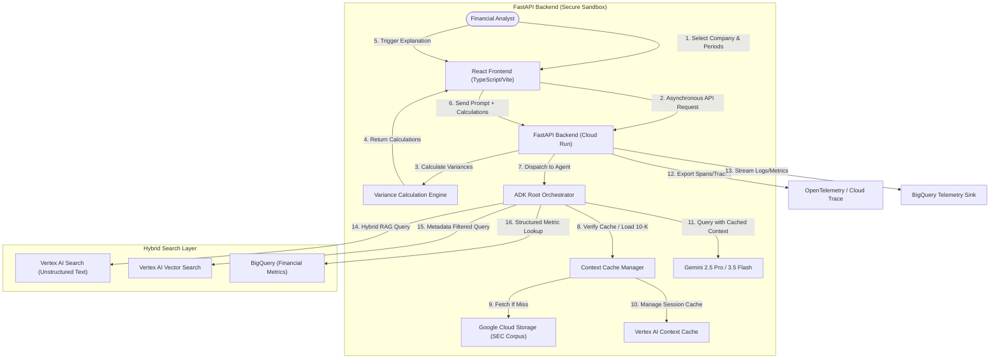

# Technical Design Document

# FDE Technical Design Document

## Project Name: SEC EDGAR Natural Language Analyst

**FDE Lead(s):** Google Cloud FDE Team (buddy/manager review)  
**Last Updated:** June 13, 2026  
**Status:** Under Review

---

## Executive Summary

Apex Financial Group requires a tool to automate the generation of period-over-period financial variance reports. Financial analysts currently spend significant time reading dense SEC 10-K filings to explain changes in key metrics (e.g., why revenue grew but margins shrunk).

This Technical Design Document outlines the architecture for the **SEC EDGAR Natural Language Analyst**, an agentic system that:

1. **Separates calculation from synthesis**: Performs deterministic variance calculations for **Revenue**, **Operating Income**, and **Net Income**.  
2. **Grounds narratives with citations**: Generates explanations cited directly to the source 10-K sections, displayed in a split-pane source viewer.  
3. **Leverages Hybrid Search**: Leverage hybrid search techniques to unify retrieval of structured financial metrics and unstructured 10-K text.  
4. **Enables Longitudinal Tracking**: Tracks specific thematic shifts (e.g., AI-related risk disclosures) across multiple fiscal periods (2024-2026).

### Core "North Star" Metrics

* **Accuracy Rate**: 100% agreement between the numbers presented in the narrative report and the deterministic calculation engine outputs; minimize potential hallucinations via strict grounding.  
* **Response Time (Latency)**: p95 latency \<= 3.0 seconds “Time to First Thought”.  
* **Grounding Recall**: \>=92% relevance mapping when extracting explanation text from the 10-K.  
* **Toxicity / Injection Redaction**: 100% safety compliance for financial projections and prompt safety.  
* **RAG Retrieval Precision**: Unified retrieval across structured financial metrics and unstructured text using hybrid search with metadata filtering.

---

## System Architecture

### High-Level Diagram

### Architecture Principles

* **Modularity**: Decoupled design where the calculation engine, the context cache manager, and the ADK orchestrator are independent, allowing models and calculation logic to be updated without modifying other components.  
* **Scalability**: Hosted on Google Cloud Run with automated scaling bounds to handle multiple concurrent analyst sessions.  
* **Resilience**: Implements defensive retry policies with exponential backoff for Vertex AI API calls. Standardizes fallbacks to handle cache misses gracefully.  
* **Hybrid Data Foundation**: Integrates Vertex AI Search and Vector Search with BigQuery to provide a unified data foundation for metadata-filtered RAG.

### Recommended Technical Components & Agent Logic

* **Agent Development Kit (ADK)**: Orchestrates the central supervisor (`RootOrchestrator`) and specialized tools:  
  * **FinancialAnalystAgent**: Responsible for reasoning and extracting narrative explanations from the 10-K.  
  * **LookerQueryTool / MetricFetchTool**: Helper tools to retrieve raw metrics.  
* **Reasoning Strategy**: Employs a structured ReAct execution loop. The agent evaluates the calculated variances, queries the cached 10-K context for explanation, and formats the output.  
* **Context & Memory Strategy**: Ensure tracking of latency due to context in model calls. Gemini 3.5 Flash is utilized for coding assistance and evaluation tasks, while Gemini 2.5 Pro handles complex financial reasoning.

### Tooling & External Integrations

* **Tool Registration**: Tool definitions (e.g. calculation engine endpoints) are registered natively inside the ADK framework using explicit Pydantic type schemas.  
* **Function Calling Logic**: Standardized exception wrappers handle API rate limits (HTTP 429\) and timeouts.

---

## Infrastructure, Security, & IAM

### GCP Project Structure

* **Dev Project ID**: fde-sec-edgar-sandbox-dev  
* **Region**: us-central1 (Core deployment target)  
* **Deployment Topology**: 100% self-contained inside the new hire's allocated sandbox.

### User Authentication (AuthN)

* **Identity Provider**: Integrated via Google Workspace Okta/SSO.  
* **Access Patterns**: Internal APIs are protected using Identity-Aware Proxy (IAP), requiring JWT-based bearer authentication.

### Authorization (AuthZ)

* **Role-Based Access Control (RBAC)**: Group-based access definitions managed via Cloud Identity Groups.  
* **Service Accounts**: The application runs under a custom service account (`sec-analyst-sa@<project name>.iam.gserviceaccount.com`)  
* **Agent Identities**: Granular, per-agent identities enforce Least Privilege for service-to-service communication.

### Data Protection & Compliance

* **Encryption**: 100% of data is encrypted in transit using TLS 1.3. Be able to explain to the customer how GMEK protects their Data-at-Rest.  
* **VPC Service Controls (VPC-SC)**: A strict service perimeter locks down Vertex AI, Cloud Run, GCS, and BigQuery.  
* **PII / Sensitive Data**: Standard filters check for sensitive internal data or financial projection leaks.

### AI Safety & Prompt Management

* **GCP Agent Runtime Model Armor**: Redacts toxic content, prompt injection attempts, and prevents jailbreaks.  
* **Custom Guardrails**:  
  * **Strict Grounding Lock**: Force the model to only explain variances using the provided text, refusing external general knowledge queries.  
  * **Fact Checks**: Post-generation verification comparing output values against calculation values.  
* **Prompt Lifecycle**: Prompts are stored in a versioned repository and loaded dynamically.

### CI/CD

* Deployed via Cloud Build triggered automatically upon successful Git merges.  
* The pipeline executes formatting checks, lints, and triggers a pytest suite (achieving \>80% code coverage) with math verification and mock API responses.

---

## Data Engineering & Intelligence

### Data Sources & Usage

* **Source Systems**: Curated SEC 10-K Markdown/Text files stored in a secure Google Cloud Storage bucket (`gs://<unique bucket name>/`).  
* **Data Profiles**: Unstructured text (10-K) and structured financial values (JSON) **Revenue**, **Operating Income**, and **Net Income**.  
* **Access Patterns**: Real-time narrative synthesis using Gemini Context Caching.

### Retrieval & Intelligence Strategy Recommendations

* **Hybrid Search RAG Architecture**: Combines Vertex AI Search (unstructured text retrieval), Vertex AI Vector Search (semantic retrieval), and BigQuery (structured financial metrics) to support complex natural language queries. This facilitates metadata-filtered RAG for longitudinal thematic tracking and multi-company comparisons.  
* **Gemini Enterprise Agent Platform (GEAP) Agent Search (fka. Vertex AI Search)**: Used as initial document locator or for searching cross-document trends.

---

## Testing & Evaluation Framework

* **Automated Verification**: A pytest suite with mocked LLM and Search APIs, achieving \>80% code coverage, including math verification and regression checks.  
* **LLM-as-a-Judge**: Utilizes Gemini 3.5 Flash to evaluate narrative faithfulness, explanation quality, and thematic consistency against the golden dataset.  
* **Ground Truth**: A golden dataset of 20+ query-variance-explanation mappings stored in BigQuery is used to run regression checks (e.g. `make eval-all`) before deployment.

---

## Analytics, Insights & Feedback

### User Behavior & Engagement

* **User Actions**: Frontends log thumbs-up/down feedback and custom comments directly into a collections table (i.e. CloudSQL, FireStore, etc.).  
* **Session Metrics**: Tracks session length, companies analyzed, and report generation counts.

### Operational & Business Intelligence

* **Usage & Cost**: Logs token consumption (including cached token discount savings) to BigQuery to monitor GCP spend.  
* **Performance Trends**: Captures TTFT (Time to First Token) and total latency.  
* **BI Dashboards**: Exported to Looker to visualize tool usage, average latency, and estimated cost savings from caching.

### Observability & Audit

* **Logging**: FastAPI backend produces structured JSON logs containing trace IDs, exported directly to Cloud Logging.  
* **Audit Trails**: Logs track who accessed which company's 10-K report and when, ensuring compliance with SEC data access guidelines.

